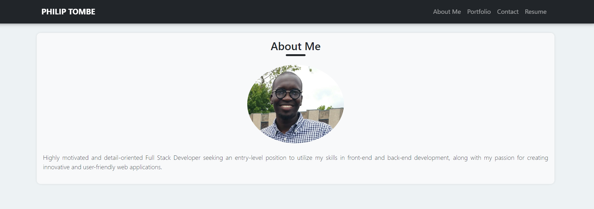

# Portfolio Website



## Description

This project is a portfolio website for showcasing a developer's work samples, including single-page applications built with React. The website provides sections for About Me, Portfolio, Contact, and Resume, allowing potential employers to assess the candidate's skills and experience.

## Features

- Single-page application portfolio
- Navigation menu with sections for About Me, Portfolio, Contact, and Resume
- Responsive design using React Bootstrap
- Contact form validation for name, email, and message fields
- Email contact option for direct communication

## Installation

1. Clone the repository:

```bash
git clone https://github.com/Philip-Tom/portfolio.git
```

2. Navigate to the project directory:
```bash
cd portfolio
```
3. Install dependencies:
```bash
npm i
```

4. Start the development server:
```bash
npm run dev
```

5. Open your browser and go to `http://localhost:5173/` to view the website.


## Technologies Used 
- Vite + React.js
- React Bootstrap
- React Router DOM
- HTML5
- CSS3
- JavaScript

## Usage
- About Me: Learn more about the developer, their background, and skills.
- Portfolio: View the developer's work samples with links to deployed applications.
- Contact: Send a message to the developer using the contact form.
- Resume: Download the developer's resume and view their proficiencies.


## Deployed Link 🌐
[Click Here](https://philip-tom.netlify.app/)
